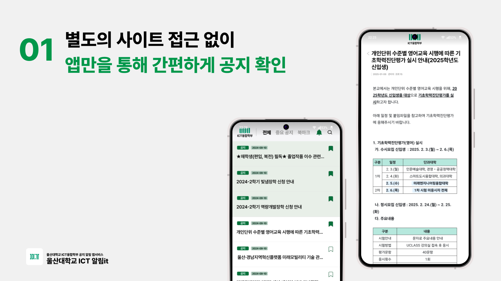

# )  
> **알림it: 울산대학교 ICT융합학부 알림 확인 앱 서비스**

📌 **Introduction**  
알림it은 울산대학교 ICT융합학부 재학생들이 중요한 공지와 알림을 빠르고 쉽게 확인할 수 있도록 돕는 앱 서비스입니다. 학내 공지사항, 수업 일정, 시험 정보 등을 자동으로 확인하고 관리할 수 있어, 학우들의 학교 생활을 보다 효율적으로 지원합니다😄

<!--  -->

🎉 **Joining Guide**  
알림it 앱에 참여하려면 다음의 조건을 만족해야 합니다:

- 알림it이 제공하는 기능이 실제로 울산대학교 학우들에게 도움이 될 수 있어야 합니다.
- 앱 기능이 기존 알림it 앱과 겹치지 않도록 개선이나 추가 기능을 고려해야 합니다.
- 앱에 기여하기 위해서는 기존 프로젝트에 대한 개선 작업을 통해 기여가 가능하며, 이를 위해 코드 품질과 버전 관리가 중요합니다.
- 앱은 최신 버전의 언어/도구를 사용하고, 코드 및 커밋 컨벤션, README 작성 등의 표준을 준수해야 합니다.

📝 **Contribution Guide**  
알림it은 완전 새롭게 개발하는 것뿐만 아니라 기존 프로젝트에 기여하는 방식으로도 참여가 가능합니다. 기여 시 고려해야 할 사항은 다음과 같습니다:

- 기여하려는 레포지토리에 명시된 Contribution Guide를 따릅니다.
- 프로젝트의 코드 스타일을 존중하고, 기존 커밋 컨벤션을 따릅니다.
- Pull Request 시, 자신이 구현하거나 개선한 기능에 대해 명확한 설명을 작성합니다.

🏷️ **License Guide**  
알림it 앱 프로젝트는 **MIT 라이선스** 하에 배포됩니다. 모든 기여자는 해당 라이선스를 준수해야 하며, 코드 사용 시 반드시 라이선스를 확인하고 준수해야 합니다.

> **문의**: 프로젝트 관련 질문이나 기여 문의는 [email@example.com](mailto:email@example.com)으로 보내주세요!👍
