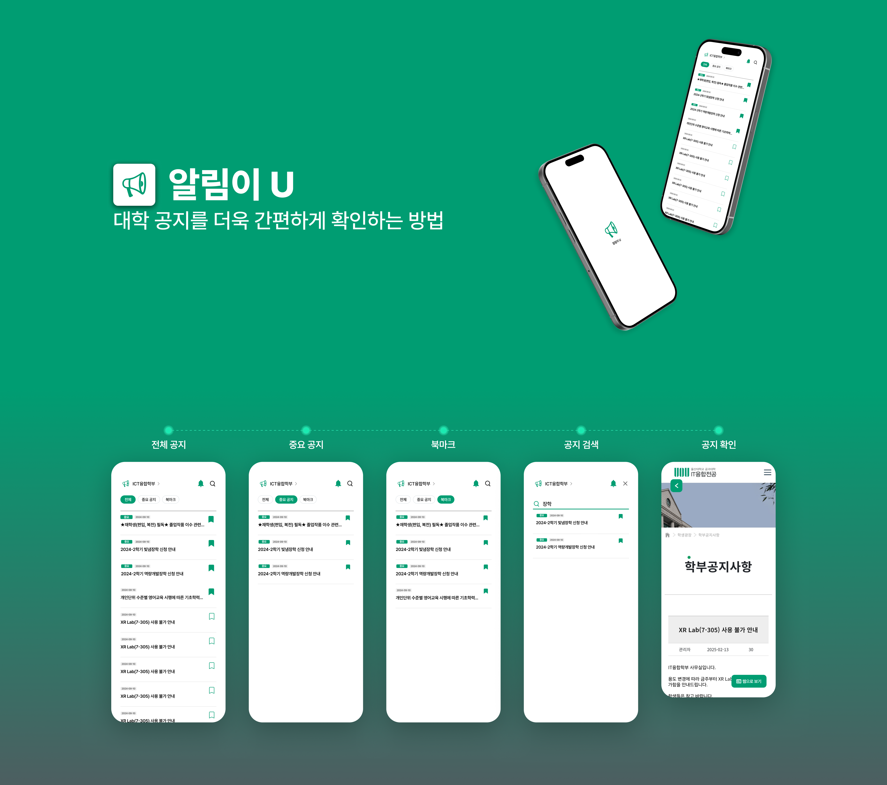
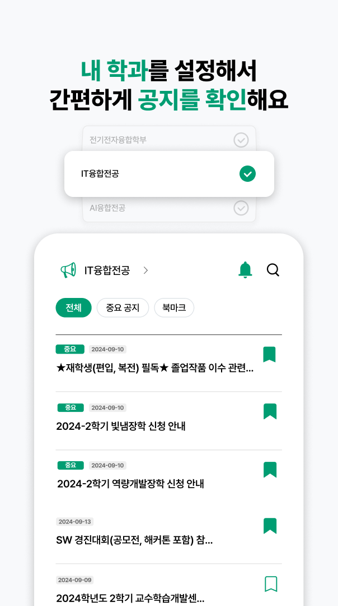
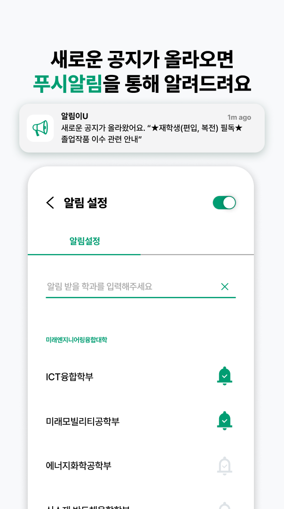
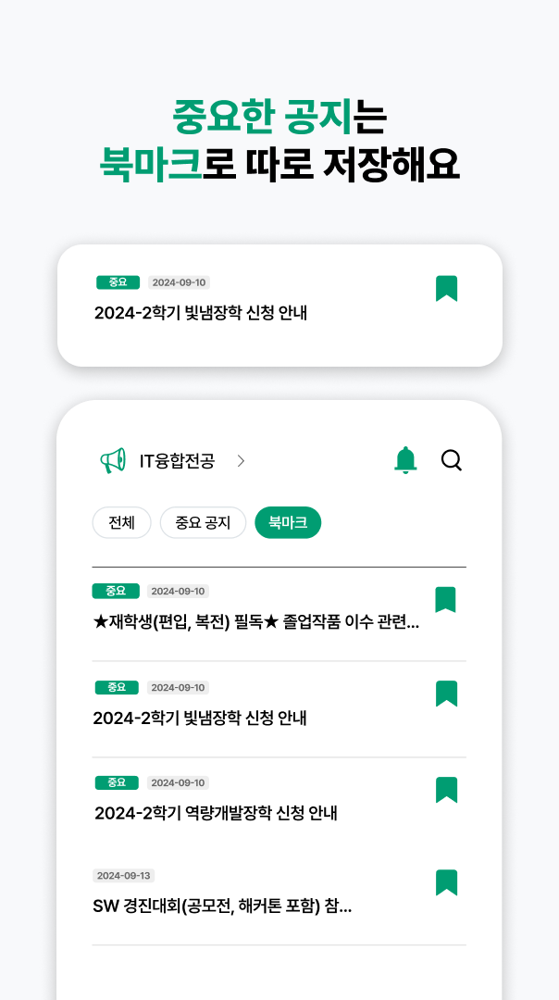

#  
> **알림이U: 울산대학교 공지 확인 앱 서비스**

<h1 style="font-size: 60px;">알림이U</h1>

📌 **Introduction**  
알림이U는 울산대학교 재학생들이 학부 공지사항을 빠르고 간편하게 확인할 수 있는 알림 앱 서비스입니다. '알림이U'의 알림, 검색, 북마크 기능 등을 통해 더욱 간편하게 학부 공지를 이할 수 있습니다😄

📝 **App Guide**  
'알림이U'는 울산대학교 IT 융합학부 재학생들에 의해 기획&제작 운영 되고 있는 프로젝트입니다.

🎉 **User Guide**  
알림이U를 통해 다음과 같은 서비스를 이용할 수 있습니다!

  
  
  
  

**Release**

> **문의**: 프로젝트 관련 질문이나 기여 문의는 [asdf009D72@gmail.com](asdf009D72@gmail.com)으로 보내주세요!👍
